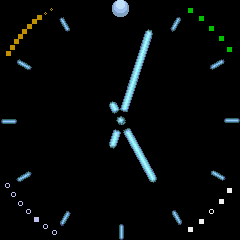

## Glow watch face

This is a numeric-free analog watch. Hands and tiks are images that have a glow effect.

The date, day-of-week, battery level and step counter are depicted using simple dots in each corner. 

- Lower left: Day of the week. Dots start at '8' position and go clockwise indicating SUN through SAT. 
- Upper left: Step counter: Each dot represents 1k steps. First level is bronze (up to 9999 steps), then silver (10k - 19.9k), then gold (20k+)
- Upper right: Battery. This runs counter (anti) clockwise starting at '2' position. Each dot is 20%. When level is < 30, dots turn yellow.
- Lower right: Date. This is for the nerds. It's in binary

This depends on the m_vatch modules for time keeping, step management, alarms, messaging and night mode.
